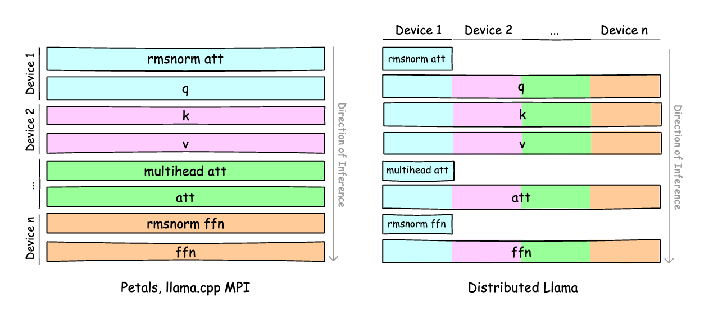

# Distributed Llama

[](https://github.com/b4rtaz/distributed-llama/actions) [](/LICENSE) [](https://n4no.com/projects/distributedLlama/discord.php)

Connect home devices into a powerful cluster to accelerate LLM inference. More devices mean faster performance, leveraging tensor parallelism and high-speed synchronization over Ethernet.

Supports Linux, macOS, and Windows. Optimized for ARM and x86_64 AVX2 CPUs.

**How to Run**
- [💻 How to Run on Linux, MacOS or Windows](./docs/HOW_TO_RUN_LINUX_MACOS_WIN.md)
- [🍓 How to Run on Raspberry Pi](./docs/HOW_TO_RUN_RASPBERRYPI.md)
- [🧠 How to Run on GPU](./docs/HOW_TO_RUN_GPU.md)

**News**
- 16 Sep 2025 - Qwen 3 MoE models are now supported on Vulkan.
- 5 Sep 2025 - Qwen 3 MoE models are now supported on CPU.
- 3 Aug 2025 - Qwen 3 0.6B, 1.7B, 8B and 14B models are now supported.
- 23 Mar 2025 - [🌋 Experimental Vulkan support](https://github.com/b4rtaz/distributed-llama/releases/tag/v0.13.0)
- 12 Feb 2025 - 🚧 Merged the [fundamental codebase refactor](https://github.com/b4rtaz/distributed-llama/releases/tag/v0.12.0)
- 9 Jan 2025 - [🍎 Llama 3.3 70B on 4 x Mac Mini M4 Pro 24GB RAM](https://github.com/b4rtaz/distributed-llama/discussions/147)

### 🔥 Setup Root Node by Single Command

Python 3 and C++ compiler required. The command will download the model and the tokenizer.

| Model                             | Size     | Command                                              |
| --------------------------------- | -------- | ---------------------------------------------------- |
| Llama 3.1 8B Instruct Q40         | 6.32 GB  | `python launch.py llama3_1_8b_instruct_q40`          |
| Llama 3.1 405B Instruct Q40       | 238 GB   | `python launch.py llama3_1_405b_instruct_q40`.       |
| Llama 3.2 1B Instruct Q40         | 1.7 GB   | `python launch.py llama3_2_1b_instruct_q40`          |
| Llama 3.2 3B Instruct Q40         | 3.4 GB   | `python launch.py llama3_2_3b_instruct_q40`          |
| Llama 3.3 70B Instruct Q40        | 40 GB    | `python launch.py llama3_3_70b_instruct_q40`         |
| DeepSeek R1 Distill Llama 8B Q40  | 6.32 GB  | `python launch.py deepseek_r1_distill_llama_8b_q40`  |
| Qwen 3 0.6B Q40                   | 0.9 GB   | `python launch.py qwen3_0.6b_q40`                    |
| Qwen 3 1.7B Q40                   | 2.2 GB   | `python launch.py qwen3_1.7b_q40`                    |
| Qwen 3 8B Q40                     | 6.7 GB   | `python launch.py qwen3_8b_q40`                      |
| Qwen 3 14B Q40                    | 10.9 GB  | `python launch.py qwen3_14b_q40`                     |
| Qwen 3 30B A3B Q40                | 17.0 GB  | `python launch.py qwen3_30b_a3b_q40`                 |

### 🛠️ Convert Model Manually

* [🤗 How to Convert Hugging Face Model](./docs/HOW_TO_CONVERT_HF_MODEL.md)

### 🚧 Known Limitations

* You can run Distributed Llama only on 1, 2, 4... 2^n nodes.
* The maximum number of nodes is equal to the number of KV heads in the model [#70](https://github.com/b4rtaz/distributed-llama/issues/70).
* Only the following quantizations are supported [#183](https://github.com/b4rtaz/distributed-llama/issues/183):
  * `q40` model with `q80` `buffer-float-type`
  * `f32` model with `f32` `buffer-float-type`

### 👷 Architecture

````
[🔀 SWITCH OR ROUTER]
      | | | |
      | | | |_______ 🔸 device1 (ROOT)     10.0.0.1
      | | |_________ 🔹 device2 (WORKER 1) 10.0.0.2:9999
      | |___________ 🔹 device3 (WORKER 2) 10.0.0.3:9999
      |_____________ 🔹 device4 (WORKER 3) 10.0.0.4:9999
                        ...
````

The project is split up into two parts:
* **🔸 Root node** - it's responsible for loading the model and weights and forward them to workers. Also, it synchronizes the state of the neural network. The root node is also a worker, it processes own slice of the neural network.
* **🔹 Worker node** - it processes own slice of the neural network. It doesn't require any configuration related to the model.

You always need the root node and you can add 2^n - 1 worker nodes to speed up the inference. The RAM usage of the neural network is split up across all nodes. The root node requires a bit more RAM than worker nodes.

### 🎹 Commands

* `dllama inference` - run the inference with a simple benchmark,
* `dllama chat` - run the CLI chat,
* `dllama worker` - run the worker node,
* `dllama-api` - run the API server.

<details>

<summary>🎹 Supported Arguments</summary>

<br />Inference, Chat, API

| Argument                     | Description                                                      | Example                                |
| ---------------------------- | ---------------------------------------------------------------- | -------------------------------------- |
| `--model <path>`             | Path to model.                                                   | `dllama_model_meta-llama-3-8b_q40.m`   |
| `--tokenizer <path>`         | Tokenizer to model.                                              | `dllama_tokenizer_llama3.t`            |
| `--buffer-float-type <type>` | Float precision of synchronization.                              | `q80`                                  |
| `--workers <workers>`        | Addresses of workers (ip:port), separated by space.              | `10.0.0.1:9999 10.0.0.2:9999`          |
| `--max-seq-len <n>`          | The maximum sequence length, it helps to reduce the RAM usage.   | `4096`                                 |

Inference, Chat, Worker, API

| Argument                     | Description                                                           | Example                             |
| ---------------------------- | --------------------------------------------------------------------- | ----------------------------------- |
| `--nthreads <n>`             | Amount of threads. Don't set a higher value than number of CPU cores. | `4`                                 |

Worker, API

| Argument                     | Description                       | Example           |
| ---------------------------- | --------------------------------- | ----------------- |
| `--port <port>`              | Binding port.                     | `9999`            |

Inference

| Argument                     | Description                    | Example            |
| ---------------------------- | ------------------------------ | ------------------ |
| `--prompt <prompt>`          | Initial prompt.                | `"Hello World"`    |
| `--steps <steps>`            | Number of tokens to generate.  | `256`              |

</details>

## 📊 Measurements

Please check the [discussions](https://github.com/b4rtaz/distributed-llama/discussions) section, where many measurements were published on different configurations.

## ✋ Contribution

Feel free to contribute to this project. For small changes, simply create a new merge request. For larger changes, please create an issue to discuss your plans. Please follow these guidelines when contributing:

* Make only minimal changes and avoid modifying files that are not necessary.
* Ensure the code is compatible across all supported systems and CPUs.
* This repository is maintained in English.

## 💡 License

This project is released under the MIT license.

## 📖 Citation

```
@misc{dllama,
  author = {Bartłomiej Tadych},
  title = {Distributed Llama},
  year = {2024},
  publisher = {GitHub},
  journal = {GitHub repository},
  howpublished = {\url{https://github.com/b4rtaz/distributed-llama}},
  commit = {7eb77ca93ec0d502e28d36b6fb20039b449cbea4}
}
```
