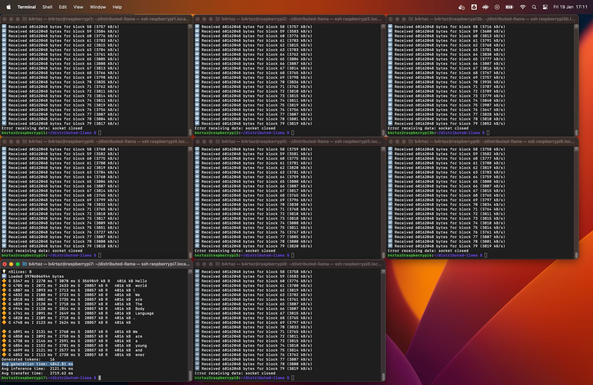
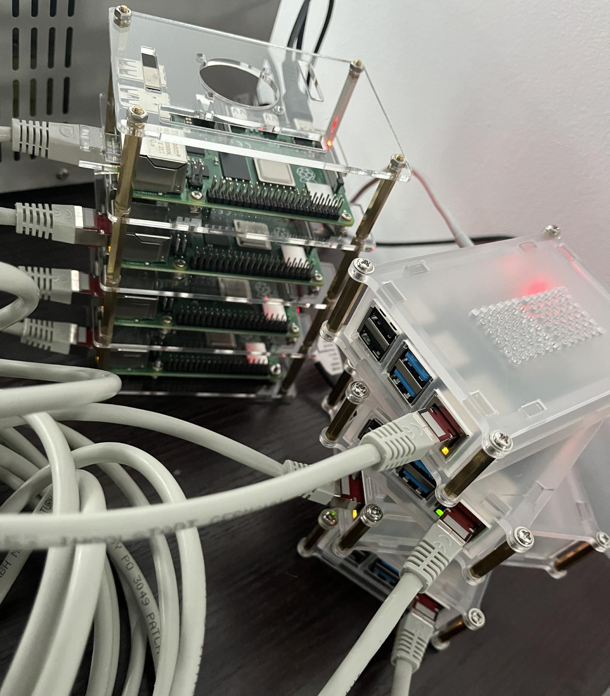

# Distributed Llama

[](https://github.com/b4rtaz/distributed-llama/actions) [](/LICENSE) [](https://discord.gg/7M4BXkM4)

Tensor parallelism is all you need. Run LLMs on weak devices or make powerful devices even more powerful by distributing the workload and dividing the RAM usage. This project proves that it's possible split the workload of LLMs across multiple devices and achieve a significant speedup. Distributed Llama allows you to run huge LLMs in-house. The project uses TCP sockets to synchronize the state. You can easily configure your AI cluster by using a home router.

<p align="center">
  <br />
  <sub><sup>Distributed Llama running Llama 2 70B on 8 Raspberry Pi 4B devices</sup></sub>
</p>

### 🔥 Start by Single Command

Python 3 and C++ compiler required.

| Model                   | Purpose   | Size     | Command                                   |
| ----------------------- | --------- | -------- | ----------------------------------------- |
| Llama 3 8B Q40          | Benchmark | 6.32 GB  | `python launch.py llama3_8b_q40`          |
| Llama 3 8B Instruct Q40 | Chat, API | 6.32 GB  | `python launch.py llama3_8b_instruct_q40` |

### 🛠️ Convert Model Manually

Supported architectures: Llama, Mixtral, Grok

* [How to Convert Llama 2, Llama 3](./docs/LLAMA.md)

### 🚧 Known Limitations

* You can run Distributed Llama only on 1, 2, 4... 2^n nodes.
* The maximum number of nodes is equal to the number of KV heads in the model [#70](https://github.com/b4rtaz/distributed-llama/issues/70). 
* Optimized for (weights format × buffer format):
  * ARM CPUs
    * ✅ F32 × F32
    * ❌ F16 × F32
    * ❌ Q40 × F32
    * ✅ Q40 × Q80
  * x86_64 AVX2 CPUs
    * ❌ F32 × F32
    * ❌ F16 × F32
    * ❌ Q40 × F32
    * ✅ Q40 × Q80

### 👷 Architecture

The project is split up into two parts:
* **Root node** - it's responsible for loading the model and weights and forward them to workers. Also, it synchronizes the state of the neural network. The root node is also a worker, it processes own slice of the neural network.
* **Worker node** - it processes own slice of the neural network. It doesn't require any configuration related to the model.

You always need the root node and you can add 2^n - 1 worker nodes to speed up the inference. The RAM usage of the neural network is split up across all nodes. The root node requires a bit more RAM than worker nodes.

## 📊 Measurements

### Average Token Generation Time

I - inference time of the root node, T - network transfer time of the root node.

**Raspberry Pi 5 8GB**

<sub><sup>Weights = Q40, Buffer = Q80, nSamples = 16, switch = TP-Link LS1008G, tested on 0.3.1 version</sup></sub>

| Model       | 1 x RasPi 5 8 GB                                                    | 2 x RasPi 5 8 GB                                                    | 4 x RasPi 5 8 GB                                                    |
|-------------|---------------------------------------------------------------------|---------------------------------------------------------------------|---------------------------------------------------------------------|
| Llama 2 7B  | **441.09 ms**, 2.26 t/s<br><sub><sup>I: 434.84 ms, T: 5.25 ms</sup></sub> | **341.46 ms**, 2.92 t/s<br><sub><sup>I: 257.78 ms, T: 83.27 ms</sup></sub>   | **219.08 ms**, 4.56 t/s 🔥<br><sub><sup>I: 163.42 ms, T: 55.25 ms</sup></sub> |
| Llama 3 8B  | **564.31 ms**, 1.77 t/s<br><sub><sup>I: 556.67 ms, T: 6.17 ms</sup></sub> | **444.27 ms**, 2.25 t/s<br><sub><sup>I: 362.73 ms, T: 80.11 ms</sup></sub>   | **331.47 ms**, 3.01 t/s 🔥<br><sub><sup>I: 267.62 ms, T: 62.34 ms</sup></sub> |

**Raspberry Pi 4B 8 GB**

<sub><sup>Weights = Q40, Buffer = Q80, nSamples = 16, switch = TP-Link LS1008G, tested on 0.1.0 version</sup></sub>

<p align="center">
  <br />
  <sub><sup>8 x Raspberry Pi 4B 8GB</sup></sub>
</p>

| Model       | 1 x RasPi 4B 8 GB                                                   | 2 x RasPi 4B 8 GB                                                     | 4 x RasPi 4B 8 GB                                                                    | 8 x RasPi 4B 8 GB                                                    |
|-------------|---------------------------------------------------------------------|-----------------------------------------------------------------------|--------------------------------------------------------------------------------------|----------------------------------------------------------------------|
| Llama 2 7B  | **1312.50 ms**<br><sub><sup>I: 1307.94 ms, T: 1.81 ms</sup></sub> | **793.69 ms**<br><sub><sup>I: 739.00 ms, T: 52.50 ms</sup></sub>    | **494.00 ms** 🔥               <br><sub><sup>I: 458.81 ms, T: 34.06 ms</sup></sub> | **588.19 ms**<br><sub><sup>I: 296.69 ms, T: 289.75 ms</sup></sub>  |
| Llama 2 13B | <sub><sup>Not enough RAM</sup></sub>                                | **1497.19 ms**<br><sub><sup>I: 1465.06 ms, T: 30.88 ms</sup></sub>  | **848.19 ms** 🔥<br><sub><sup>I: 746.88 ms, T: 99.50 ms</sup></sub>                | **1114.88 ms**<br><sub><sup>I: 460.8 ms, T: 652.88 ms</sup></sub>  |
| Llama 2 70B | <sub><sup>Not enough RAM</sup></sub>                                | <sub><sup>Not enough RAM</sup></sub>                                  | <sub><sup>Not enough RAM</sup></sub>                                                 | **4842.81 ms** 🔥<br><sub><sup>I: 2121.94 ms, T: 2719.62 ms</sup></sub> |

**x86_64 CPU Cloud Server**

<sub><sup>Weights = Q40, Buffer = Q80, nSamples = 16, VMs = [c3d-highcpu-30](https://github.com/b4rtaz/distributed-llama/discussions/9), tested on 0.1.0 version</sup></sub>

| Model       | 1 x VM                                                              | 2 x VM                                                                | 4 x VM                                                                               |
|-------------|---------------------------------------------------------------------|-----------------------------------------------------------------------|--------------------------------------------------------------------------------------|
| Llama 2 7B  | **101.81 ms**<br><sub><sup>I: 101.06 ms, T: 0.19 ms</sup></sub>   | **69.69 ms**<br><sub><sup>I: 61.50 ms, T: 7.62 ms</sup></sub>       | **53.69 ms** 🔥<br><sub><sup>I: 40.25 ms, T: 12.81 ms</sup></sub>                  |
| Llama 2 13B | **184.19 ms**<br><sub><sup>I: 182.88 ms, T: 0.69 ms</sup></sub>   | **115.38 ms**<br><sub><sup>I: 107.12 ms, T: 7.81 ms</sup></sub>     | **86.81 ms** 🔥<br><sub><sup>I: 66.25 ms, T: 19.94 ms</sup></sub>                  |
| Llama 2 70B | **909.69 ms**<br><sub><sup>I: 907.25 ms, T: 1.75 ms</sup></sub>   | **501.38 ms**<br><sub><sup>I: 475.50 ms, T: 25.00 ms</sup></sub>    | **293.06 ms** 🔥<br><sub><sup>I: 264.00 ms, T: 28.50 ms</sup></sub>                  |

### Network Transfer for Generating Token

**F32 Buffer**

| Model       | 2 devices      | 4 devices     | 8 devices     |
|-------------|----------------|---------------|---------------|
| Llama 3 8B  | **2048 kB**    | **6144 kB**   | **14336 kB**  |

**Q80 Buffer**

| Model       | 2 devices    | 4 devices     | 8 devices      |
|-------------|--------------|---------------|----------------|
| Llama 3 8B  | **544 kB**   | **1632 kB**   | **3808 kB**    |

## 📟 Setup Raspberry Pi Devices

1. Install `Raspberry Pi OS Lite (64 bit)` on your Raspberry Pi devices. This OS doesn't have desktop environment.
2. Connect all devices to your switch or router.
3. Connect to all devices via SSH.
```
ssh user@raspberrypi1.local
ssh user@raspberrypi2.local
```
4. Install Git:
```sh
sudo apt install git
```
5. Clone this repository and compile Distributed Llama on all devices:
```sh
git clone https://github.com/b4rtaz/distributed-llama.git
make dllama
```
6. Transfer weights and the tokenizer file to the root device.
7. Optional: assign static IP addresses.
```sh
sudo ip addr add 10.0.0.1/24 dev eth0 # 1th device
sudo ip addr add 10.0.0.2/24 dev eth0 # 2th device
```
8. Run worker nodes on worker devices:
```sh
sudo nice -n -20 ./dllama worker --port 9998 --nthreads 4
```
9. Run root node on the root device:
```sh
sudo nice -n -20 ./dllama inference --model dllama_model_meta-llama-3-8b_q40.m --tokenizer dllama_tokenizer_llama3.t --buffer-float-type q80 --prompt "Hello world" --steps 16 --nthreads 4 --workers 10.0.0.2:9998
```

To add more worker nodes, just add more addresses to the `--workers` argument.

```
./dllama inference ... --workers 10.0.0.2:9998 10.0.0.3:9998 10.0.0.4:9998
```

## 💻 Setup computers with MacOS, Linux, or Windows

You need x86_64 AVX2 CPUs or ARM CPUs. Different devices may have different CPUs.

#### MacOS or Linux

The below instructions are for Debian-based distributions but you can easily adapt them to your distribution, macOS.

1. Install Git and GCC:
```sh
sudo apt install git build-essential
```
2. Clone this repository and compile Distributed Llama on all computers:
```sh
git clone https://github.com/b4rtaz/distributed-llama.git
make dllama
```

Continue to point 3.

#### Windows

1. Install Git and Mingw (via [Chocolatey](https://chocolatey.org/install)):
```powershell
choco install mingw
```
2. Clone this repository and compile Distributed Llama on all computers:
```sh
git clone https://github.com/b4rtaz/distributed-llama.git
make dllama
```

Continue to point 3.

#### Run Cluster

3. Transfer weights and the tokenizer file to the root computer.
4. Run worker nodes on worker computers:
```sh
./dllama worker --port 9998 --nthreads 4
```
5. Run root node on the root computer:
```sh
./dllama inference --model dllama_model_meta-llama-3-8b_q40.m --tokenizer dllama_tokenizer_llama3.t --buffer-float-type q80 --prompt "Hello world" --steps 16 --nthreads 4 --workers 192.168.0.1:9998
```

To add more worker nodes, just add more addresses to the `--workers` argument.

```
./dllama inference ... --workers 192.168.0.1:9998 192.168.0.2:9998 192.168.0.3:9998
```

## 💡 License

This project is released under the MIT license.

## 📖 Citation

```
@misc{dllama,
  author = {Bartłomiej Tadych},
  title = {Distributed Llama},
  year = {2024},
  publisher = {GitHub},
  journal = {GitHub repository},
  howpublished = {\url{https://github.com/b4rtaz/distributed-llama}},
  commit = {7eb77ca93ec0d502e28d36b6fb20039b449cbea4}
}
```
